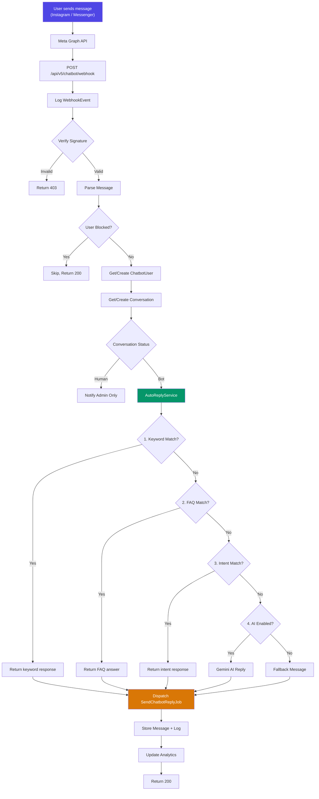

# SuGanta AI Chatbot Automation System

Build a production-ready, scalable chatbot system for Instagram & Messenger auto-replies using Meta Graph API webhooks, integrated into the existing SuGanta Laravel 12 platform.

## User Review Required

> [!IMPORTANT]
> **Database Connection**: All chatbot tables will be created on the **`ai_mysql`** connection (database `suganta_ai`), following the same pattern as your existing `AiConversation` model. Please confirm this is correct.

> [!IMPORTANT]
> **Meta Graph API Credentials**: You will need to provide a **Meta App ID**, **App Secret**, **Page Access Token**, and **Webhook Verify Token** as `.env` variables. The system will be built to use these from config, but you'll need to set up the Meta Developer App yourself.

> [!WARNING]
> **OpenAI Integration**: The plan includes optional OpenAI integration for smart replies. You currently use Gemini and Grok. Should I use **Gemini** instead of OpenAI for the AI fallback? Or would you prefer a new OpenAI integration?

> [!IMPORTANT]
> **Route Version**: The chatbot webhook and admin API will be placed under `routes/api/v5.php` as a new API version. Confirm this is acceptable.

---

## Architecture Overview

```
User (Instagram/Messenger)
        │
        ▼
Meta Graph API Webhook ──→ WebhookController
        │
        ▼
  WebhookEventLog (logged)
        │
        ▼
  ChatbotService (main orchestrator)
    ├─ BlockedUserCheck
    ├─ ConversationManager (create/resume)
    ├─ AutoReplyService
    │    ├─ 1. Keyword Matching (keywords table)
    │    ├─ 2. FAQ Matching (faqs table)
    │    ├─ 3. Intent Detection (weighted scoring)
    │    └─ 4. AI Fallback (Gemini/OpenAI)
    ├─ LeadCaptureService
    └─ MessageLogger
        │
        ▼
  SendReplyJob (queued) ──→ Meta Graph API (send message)
        │
        ▼
  Analytics + Conversation stored in DB
```

---

## Database Schema (ER Diagram)

All tables use the **`ai_mysql`** connection (`suganta_ai` database).

```mermaid
erDiagram
    chatbot_users {
        bigint id PK
        bigint platform_user_id "Meta PSID / IGSID"
        string platform "instagram | messenger"
        string name "nullable"
        string email "nullable"
        string phone "nullable"
        string profile_pic_url "nullable"
        string locale "nullable"
        json metadata "nullable"
        boolean is_blocked "default false"
        string block_reason "nullable"
        timestamp blocked_at "nullable"
        timestamp first_seen_at
        timestamp last_seen_at
        timestamps
    }

    chatbot_conversations {
        bigint id PK
        bigint chatbot_user_id FK
        string platform "instagram | messenger"
        enum status "bot | human | closed"
        bigint assigned_admin_id FK "nullable"
        string subject "nullable"
        integer message_count "default 0"
        timestamp last_message_at "nullable"
        timestamp closed_at "nullable"
        timestamps
    }

    chatbot_messages {
        bigint id PK
        bigint conversation_id FK
        bigint chatbot_user_id FK "nullable"
        enum direction "incoming | outgoing"
        enum message_type "text | image | quick_reply | template | fallback"
        text content
        json raw_payload "nullable"
        string matched_by "keyword | faq | intent | ai | manual"
        bigint matched_faq_id FK "nullable"
        bigint matched_intent_id FK "nullable"
        string meta_message_id "nullable"
        enum delivery_status "sent | delivered | read | failed"
        integer response_time_ms "nullable"
        timestamps
    }

    chatbot_faqs {
        bigint id PK
        string question
        text answer
        string category "nullable"
        integer priority "default 0"
        boolean is_active "default true"
        integer hit_count "default 0"
        timestamps
    }

    chatbot_keywords {
        bigint id PK
        string keyword "unique"
        text response
        string category "nullable"
        integer priority "default 0"
        boolean is_active "default true"
        integer hit_count "default 0"
        timestamps
    }

    chatbot_intents {
        bigint id PK
        string name "unique"
        string description "nullable"
        float confidence_threshold "default 0.6"
        boolean is_active "default true"
        timestamps
    }

    chatbot_intent_keywords {
        bigint id PK
        bigint intent_id FK
        string keyword
        float weight "default 1.0"
        timestamps
    }

    chatbot_intent_responses {
        bigint id PK
        bigint intent_id FK
        text response
        integer priority "default 0"
        boolean is_active "default true"
        timestamps
    }

    chatbot_message_logs {
        bigint id PK
        bigint chatbot_user_id FK "nullable"
        bigint conversation_id FK "nullable"
        string platform
        enum event_type "message_received | message_sent | delivery | read | postback | referral | error"
        json payload
        string processing_status "success | failed | skipped"
        text error_message "nullable"
        integer processing_time_ms "nullable"
        timestamps
    }

    chatbot_webhook_events {
        bigint id PK
        string platform
        string event_type
        json raw_payload
        string processing_status "pending | processed | failed"
        text error_message "nullable"
        integer retry_count "default 0"
        timestamps
    }

    chatbot_bot_settings {
        bigint id PK
        string key "unique"
        text value "nullable"
        string type "string | boolean | integer | json"
        string description "nullable"
        timestamps
    }

    chatbot_leads {
        bigint id PK
        bigint chatbot_user_id FK
        bigint conversation_id FK "nullable"
        string name "nullable"
        string email "nullable"
        string phone "nullable"
        string source "instagram | messenger"
        string interest "nullable"
        json extra_data "nullable"
        enum status "new | contacted | qualified | converted | lost"
        timestamps
    }

    chatbot_analytics {
        bigint id PK
        date date
        string platform "instagram | messenger | all"
        integer total_messages_received "default 0"
        integer total_messages_sent "default 0"
        integer unique_users "default 0"
        integer new_users "default 0"
        integer keyword_matches "default 0"
        integer faq_matches "default 0"
        integer intent_matches "default 0"
        integer ai_fallbacks "default 0"
        integer no_matches "default 0"
        float avg_response_time_ms "default 0"
        integer leads_captured "default 0"
        timestamps
    }

    chatbot_users ||--o{ chatbot_conversations : "has many"
    chatbot_conversations ||--o{ chatbot_messages : "has many"
    chatbot_users ||--o{ chatbot_messages : "sent by"
    chatbot_messages }o--o| chatbot_faqs : "matched to"
    chatbot_messages }o--o| chatbot_intents : "matched to"
    chatbot_intents ||--o{ chatbot_intent_keywords : "has many"
    chatbot_intents ||--o{ chatbot_intent_responses : "has many"
    chatbot_users ||--o{ chatbot_message_logs : "logged for"
    chatbot_conversations ||--o{ chatbot_message_logs : "logged for"
    chatbot_users ||--o{ chatbot_leads : "captured as"
    chatbot_conversations ||--o{ chatbot_leads : "from conversation"
```

---

## Proposed Changes

### Component 1: Database Migrations

All migrations target the `ai_mysql` connection and are prefixed with `chatbot_` to avoid collisions with existing tables.

#### [NEW] [2026_03_30_000001_create_chatbot_tables.php](file:///c:/Users/NXTGN/Desktop/SuGanta_API/database/migrations/2026_03_30_000001_create_chatbot_tables.php)

Single migration creating all 13 chatbot tables with:
- Proper indexes on `platform_user_id`, `platform`, `status`, `direction`, `keyword`, `date`
- Foreign key constraints between related tables
- All using `$table->engine = 'InnoDB'`

---

### Component 2: Eloquent Models

All models use `protected $connection = 'ai_mysql'` following the `AiConversation` pattern.

#### [NEW] [app/Models/Chatbot/ChatbotUser.php](file:///c:/Users/NXTGN/Desktop/SuGanta_API/app/Models/Chatbot/ChatbotUser.php)
- Relationships: `conversations()`, `messages()`, `leads()`, `messageLogs()`
- Scopes: `scopeBlocked()`, `scopeByPlatform()`
- Helper: `isBlocked()`

#### [NEW] [app/Models/Chatbot/ChatbotConversation.php](file:///c:/Users/NXTGN/Desktop/SuGanta_API/app/Models/Chatbot/ChatbotConversation.php)
- Relationships: `chatbotUser()`, `messages()`, `leads()`, `messageLogs()`
- Scopes: `scopeActive()`, `scopeByStatus()`

#### [NEW] [app/Models/Chatbot/ChatbotMessage.php](file:///c:/Users/NXTGN/Desktop/SuGanta_API/app/Models/Chatbot/ChatbotMessage.php)
- Relationships: `conversation()`, `chatbotUser()`, `matchedFaq()`, `matchedIntent()`

#### [NEW] [app/Models/Chatbot/ChatbotFaq.php](file:///c:/Users/NXTGN/Desktop/SuGanta_API/app/Models/Chatbot/ChatbotFaq.php)
- Scopes: `scopeActive()`, `scopeByCategory()`

#### [NEW] [app/Models/Chatbot/ChatbotKeyword.php](file:///c:/Users/NXTGN/Desktop/SuGanta_API/app/Models/Chatbot/ChatbotKeyword.php)
- Scopes: `scopeActive()`

#### [NEW] [app/Models/Chatbot/ChatbotIntent.php](file:///c:/Users/NXTGN/Desktop/SuGanta_API/app/Models/Chatbot/ChatbotIntent.php)
- Relationships: `keywords()`, `responses()`

#### [NEW] [app/Models/Chatbot/ChatbotIntentKeyword.php](file:///c:/Users/NXTGN/Desktop/SuGanta_API/app/Models/Chatbot/ChatbotIntentKeyword.php)
- Relationship: `intent()`

#### [NEW] [app/Models/Chatbot/ChatbotIntentResponse.php](file:///c:/Users/NXTGN/Desktop/SuGanta_API/app/Models/Chatbot/ChatbotIntentResponse.php)
- Relationship: `intent()`

#### [NEW] [app/Models/Chatbot/ChatbotMessageLog.php](file:///c:/Users/NXTGN/Desktop/SuGanta_API/app/Models/Chatbot/ChatbotMessageLog.php)

#### [NEW] [app/Models/Chatbot/ChatbotWebhookEvent.php](file:///c:/Users/NXTGN/Desktop/SuGanta_API/app/Models/Chatbot/ChatbotWebhookEvent.php)

#### [NEW] [app/Models/Chatbot/ChatbotBotSetting.php](file:///c:/Users/NXTGN/Desktop/SuGanta_API/app/Models/Chatbot/ChatbotBotSetting.php)
- Static: `get($key)`, `set($key, $value)`

#### [NEW] [app/Models/Chatbot/ChatbotLead.php](file:///c:/Users/NXTGN/Desktop/SuGanta_API/app/Models/Chatbot/ChatbotLead.php)
- Relationships: `chatbotUser()`, `conversation()`

#### [NEW] [app/Models/Chatbot/ChatbotAnalytics.php](file:///c:/Users/NXTGN/Desktop/SuGanta_API/app/Models/Chatbot/ChatbotAnalytics.php)

---

### Component 3: Services (Business Logic)

#### [NEW] [app/Services/Chatbot/ChatbotService.php](file:///c:/Users/NXTGN/Desktop/SuGanta_API/app/Services/Chatbot/ChatbotService.php)

Main orchestrator:
```
handleIncomingMessage(platform, senderId, messageText, rawPayload)
  → resolveOrCreateUser()
  → checkBlocked()
  → resolveOrCreateConversation()
  → checkIfHumanHandoff() (if status=human, skip auto-reply)
  → AutoReplyService::getReply()
  → dispatch SendChatbotReplyJob
  → logMessage()
  → updateAnalytics()
```

#### [NEW] [app/Services/Chatbot/AutoReplyService.php](file:///c:/Users/NXTGN/Desktop/SuGanta_API/app/Services/Chatbot/AutoReplyService.php)

Reply matching pipeline (returns first match):
1. **Keyword match**: Exact/partial match against `chatbot_keywords` table (cached in Redis)
2. **FAQ match**: Fuzzy text similarity against `chatbot_faqs` table (cached)
3. **Intent detection**: Weighted keyword scoring from `chatbot_intent_keywords` → if score ≥ threshold → return `chatbot_intent_responses`
4. **AI fallback**: Send to Gemini (reusing `GeminiAiService`) for context-aware reply
5. **Default fallback**: Static message from `chatbot_bot_settings`

#### [NEW] [app/Services/Chatbot/MetaGraphApiService.php](file:///c:/Users/NXTGN/Desktop/SuGanta_API/app/Services/Chatbot/MetaGraphApiService.php)

Handles all Meta Graph API communication:
- `sendTextMessage(platform, recipientId, text)`
- `sendQuickReply(platform, recipientId, text, buttons)`
- `sendTemplate(platform, recipientId, template)`
- `verifyWebhookSignature(request)`
- `getUserProfile(platform, userId)`

#### [NEW] [app/Services/Chatbot/LeadCaptureService.php](file:///c:/Users/NXTGN/Desktop/SuGanta_API/app/Services/Chatbot/LeadCaptureService.php)

Captures leads from conversations when specific intents are detected (e.g., "enrollment_interest", "pricing_query").

#### [NEW] [app/Services/Chatbot/ChatbotAnalyticsService.php](file:///c:/Users/NXTGN/Desktop/SuGanta_API/app/Services/Chatbot/ChatbotAnalyticsService.php)

Aggregates daily analytics, incrementing counters per platform.

---

### Component 4: Controller

#### [NEW] [app/Http/Controllers/Api/V5/ChatbotWebhookController.php](file:///c:/Users/NXTGN/Desktop/SuGanta_API/app/Http/Controllers/Api/V5/ChatbotWebhookController.php)

| Method | Route | Purpose |
|--------|-------|---------|
| `verify()` | GET `/api/v5/chatbot/webhook` | Meta webhook verification (hub.challenge) |
| `handle()` | POST `/api/v5/chatbot/webhook` | Receive & process incoming messages |

#### [NEW] [app/Http/Controllers/Api/V5/ChatbotAdminController.php](file:///c:/Users/NXTGN/Desktop/SuGanta_API/app/Http/Controllers/Api/V5/ChatbotAdminController.php)

| Method | Route | Purpose |
|--------|-------|---------|
| `dashboard()` | GET `/api/v5/chatbot/admin/dashboard` | Analytics overview |
| `conversations()` | GET `/api/v5/chatbot/admin/conversations` | List conversations |
| `messages()` | GET `/api/v5/chatbot/admin/conversations/{id}/messages` | View messages |
| `takeover()` | POST `/api/v5/chatbot/admin/conversations/{id}/takeover` | Human handoff |
| `releaseToBot()` | POST `/api/v5/chatbot/admin/conversations/{id}/release` | Release back to bot |
| `sendManualReply()` | POST `/api/v5/chatbot/admin/conversations/{id}/reply` | Manual reply |
| `faqs()` | CRUD `/api/v5/chatbot/admin/faqs` | Manage FAQs |
| `keywords()` | CRUD `/api/v5/chatbot/admin/keywords` | Manage keywords |
| `intents()` | CRUD `/api/v5/chatbot/admin/intents` | Manage intents |
| `settings()` | GET/PUT `/api/v5/chatbot/admin/settings` | Bot settings |
| `blockUser()` | POST `/api/v5/chatbot/admin/users/{id}/block` | Block user |
| `unblockUser()` | POST `/api/v5/chatbot/admin/users/{id}/unblock` | Unblock user |
| `leads()` | GET `/api/v5/chatbot/admin/leads` | View captured leads |

---

### Component 5: Jobs & Queue

#### [NEW] [app/Jobs/SendChatbotReplyJob.php](file:///c:/Users/NXTGN/Desktop/SuGanta_API/app/Jobs/SendChatbotReplyJob.php)

Queued job to send reply via Meta Graph API:
- Retries: 3
- Timeout: 30s
- Updates `delivery_status` on success/failure
- Logs errors to `chatbot_message_logs`

#### [NEW] [app/Jobs/AggregateChatbotAnalyticsJob.php](file:///c:/Users/NXTGN/Desktop/SuGanta_API/app/Jobs/AggregateChatbotAnalyticsJob.php)

Scheduled daily job to compile analytics.

---

### Component 6: Routes

#### [NEW] [routes/api/v5.php](file:///c:/Users/NXTGN/Desktop/SuGanta_API/routes/api/v5.php)

Webhook routes (no auth) + Admin routes (auth:sanctum).

#### [MODIFY] [api.php](file:///c:/Users/NXTGN/Desktop/SuGanta_API/routes/api.php)

Add `require __DIR__.'/api/v5.php';`

---

### Component 7: Configuration

#### [NEW] [config/chatbot.php](file:///c:/Users/NXTGN/Desktop/SuGanta_API/config/chatbot.php)

```php
return [
    'meta_app_id'          => env('META_APP_ID'),
    'meta_app_secret'      => env('META_APP_SECRET'),
    'meta_page_token'      => env('META_PAGE_ACCESS_TOKEN'),
    'meta_verify_token'    => env('META_WEBHOOK_VERIFY_TOKEN'),
    'meta_api_version'     => env('META_API_VERSION', 'v19.0'),
    'ig_page_token'        => env('META_IG_PAGE_ACCESS_TOKEN'),
    'fallback_message'     => env('CHATBOT_FALLBACK_MESSAGE',
        'Thanks for reaching out! Our team will get back to you shortly.'),
    'ai_provider'          => env('CHATBOT_AI_PROVIDER', 'gemini'),  // gemini | openai
    'openai_api_key'       => env('OPENAI_API_KEY'),
    'response_timeout_ms'  => env('CHATBOT_RESPONSE_TIMEOUT', 2000),
    'cache_ttl'            => env('CHATBOT_CACHE_TTL', 3600), // 1 hour
    'lead_capture_intents' => ['enrollment_interest', 'pricing_query', 'demo_request'],
];
```

#### [MODIFY] [.env.example](file:///c:/Users/NXTGN/Desktop/SuGanta_API/.env.example)

Add chatbot-related env variables.

---

### Component 8: Seeder

#### [NEW] [database/seeders/ChatbotSeeder.php](file:///c:/Users/NXTGN/Desktop/SuGanta_API/database/seeders/ChatbotSeeder.php)

Seeds initial data:
- Default bot settings (welcome message, fallback message, bot name)
- Sample FAQs for SuGanta (pricing, booking, teacher info, etc.)
- Sample keywords and intents
- Common education-related intents: `greeting`, `pricing_query`, `teacher_search`, `enrollment_interest`, `demo_request`, `complaint`, `goodbye`

---

## API Endpoints Summary

### Webhook (Public)
| Method | Endpoint | Description |
|--------|----------|-------------|
| GET | `/api/v5/chatbot/webhook` | Meta verification |
| POST | `/api/v5/chatbot/webhook` | Incoming messages |

### Admin (Protected - `auth:sanctum`)
| Method | Endpoint | Description |
|--------|----------|-------------|
| GET | `/api/v5/chatbot/admin/dashboard` | Analytics dashboard |
| GET | `/api/v5/chatbot/admin/conversations` | List conversations |
| GET | `/api/v5/chatbot/admin/conversations/{id}/messages` | View messages |
| POST | `/api/v5/chatbot/admin/conversations/{id}/takeover` | Human handoff |
| POST | `/api/v5/chatbot/admin/conversations/{id}/release` | Release to bot |
| POST | `/api/v5/chatbot/admin/conversations/{id}/reply` | Manual reply |
| GET/POST | `/api/v5/chatbot/admin/faqs` | List/Create FAQs |
| PUT/DELETE | `/api/v5/chatbot/admin/faqs/{id}` | Update/Delete FAQ |
| GET/POST | `/api/v5/chatbot/admin/keywords` | List/Create keywords |
| PUT/DELETE | `/api/v5/chatbot/admin/keywords/{id}` | Update/Delete keyword |
| GET/POST | `/api/v5/chatbot/admin/intents` | List/Create intents |
| PUT/DELETE | `/api/v5/chatbot/admin/intents/{id}` | Update/Delete intent |
| GET/PUT | `/api/v5/chatbot/admin/settings` | View/Update settings |
| POST | `/api/v5/chatbot/admin/users/{id}/block` | Block user |
| POST | `/api/v5/chatbot/admin/users/{id}/unblock` | Unblock user |
| GET | `/api/v5/chatbot/admin/leads` | View leads |

---

## Optimization Strategy

| Technique | Applied To |
|-----------|-----------|
| **Redis Cache** | FAQs, Keywords, Bot Settings (TTL: 1 hour) |
| **Database Indexes** | `platform_user_id`, `platform`, `status`, `keyword`, `date`, `direction` |
| **Queue Jobs** | All outgoing messages dispatched via queue (`SendChatbotReplyJob`) |
| **Composite Indexes** | `(chatbot_user_id, platform)`, `(conversation_id, direction)`, `(date, platform)` |
| **Rate Limiting** | Webhook endpoint (60/min per IP) |
| **Webhook Signature Verification** | X-Hub-Signature-256 validation |

---

## System Flow Diagram



---

## Open Questions

> [!IMPORTANT]
> 1. **AI Fallback Provider**: Should I use **Gemini** (already integrated) or add a new **OpenAI** integration for the AI fallback? Gemini reuse would be faster to implement.

> [!IMPORTANT]
> 2. **Instagram vs Messenger Tokens**: Do you have separate page tokens for Instagram and Messenger, or a single unified token? This affects the `MetaGraphApiService` configuration.

> [!NOTE]
> 3. **Admin Authentication**: The admin endpoints will use the existing `auth:sanctum` middleware. Should there be an additional role check (e.g., only users with admin role can access chatbot admin)?

---

## Verification Plan

### Automated Tests
- Run `php artisan migrate --database=ai_mysql` to verify all migrations execute cleanly
- Run `php artisan db:seed --class=ChatbotSeeder` to verify seeder
- Test webhook verification endpoint with cURL
- Test auto-reply pipeline with sample messages

### Manual Verification
- Configure Meta webhook URL in Meta Developer Console
- Send test Instagram DM to verify end-to-end flow
- Verify Redis caching with `redis-cli KEYS "chatbot:*"`
- Check queue processing with `php artisan queue:work`

---

## File Count Summary

| Category | Count |
|----------|-------|
| Migration files | 1 |
| Eloquent models | 13 |
| Service classes | 5 |
| Controllers | 2 |
| Jobs | 2 |
| Config files | 1 |
| Route files | 1 (new) + 1 (modified) |
| Seeder | 1 |
| **Total new files** | **26** |
